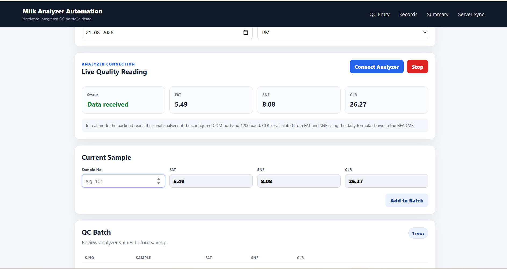
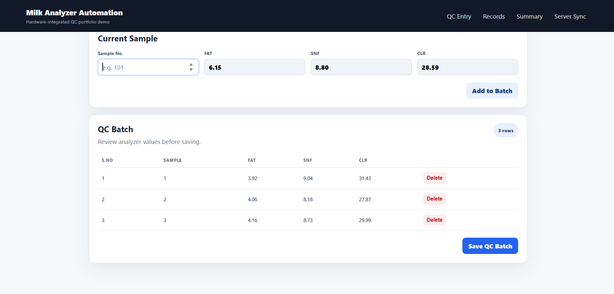
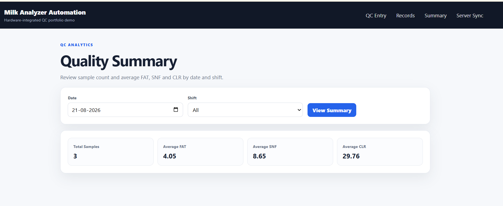
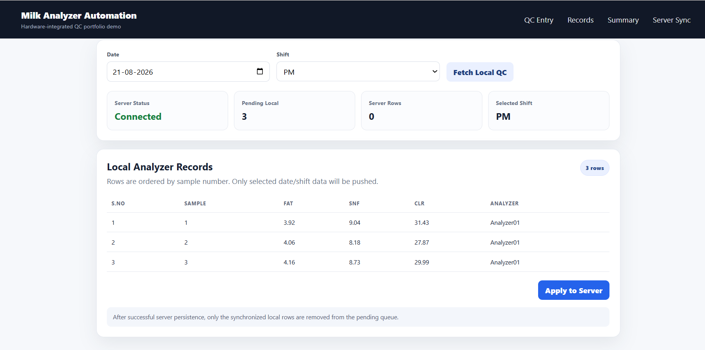
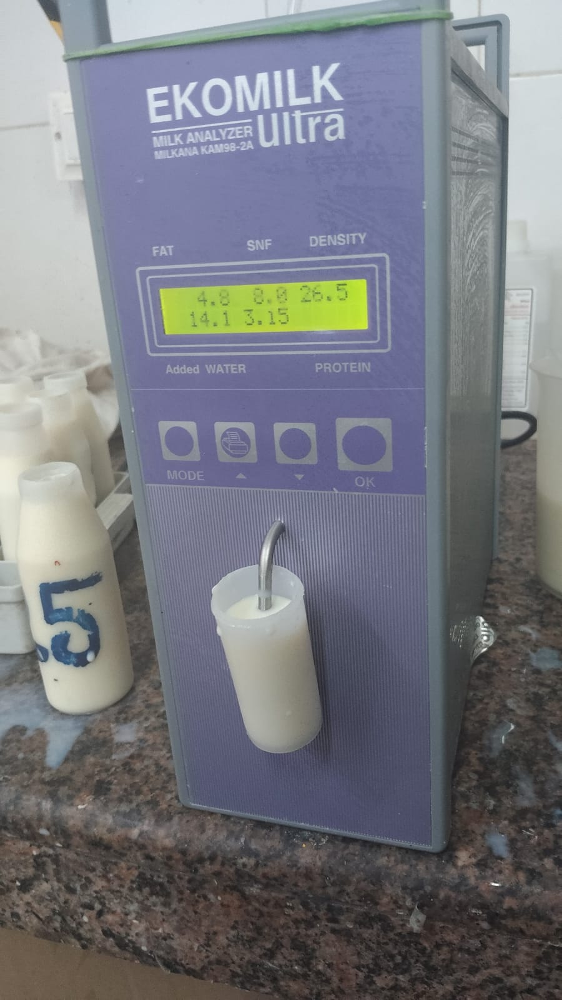

# Milk Analyzer Automation & QC Entry System

A sanitized portfolio implementation of a real-world milk quality analyzer workflow using **Python, Django, PySerial and JavaScript**.

The application connects to a serial milk analyzer, captures **FAT** and **SNF** automatically, calculates **CLR**, prevents manual editing of analyzer values, validates duplicate sample numbers, stores QC batches, synchronizes pending local QC records to a server database, and provides a simple date/shift summary.

> This public portfolio version contains no company credentials, production database configuration, customer data, internal Git history or proprietary branding.

## Why this project

Manual transcription of analyzer readings can cause typing errors and mismatched sample data. This project connects the analyzer directly to the web application so the operator can focus on the sample workflow while the quality values are captured automatically.

## Main Features

- Serial analyzer integration using **PySerial**
- Real Mode using configurable COM port and baud rate
- Demo Mode so the project can be tested without analyzer hardware
- Connection, start-reading, stop and status APIs
- Background reader thread
- FAT and SNF extraction from analyzer serial text
- Basic fallback parser for simple numeric analyzer output
- Automatic CLR calculation
- Read-only FAT, SNF and CLR fields
- Automatic re-read cycle after a successful sample
- Reading timeout and connection error handling
- Duplicate sample check in the current batch
- Duplicate sample protection in the database
- Multi-sample QC batch before final save
- Local-to-server QC synchronization by date and shift
- Server database connectivity check before push
- Sorted/unique sample preview before synchronization
- Retry-safe `update_or_create` server persistence
- Successfully synchronized local rows removed from the pending queue
- Date / shift QC summary with average FAT, SNF and CLR
- Responsive portfolio UI

## Tech Stack

- Python
- Django
- PySerial
- JavaScript / Fetch API
- HTML / CSS
- SQLite
- Serial / COM-port hardware integration

## Data Flow


## CLR Formula

The portfolio flow calculates CLR from FAT and SNF:

```text
CLR = 4 × (SNF - (0.21 × FAT) - 0.36)
```

Example:

```text
FAT = 4.50
SNF = 8.60
CLR = 29.18
```

## Analyzer Communication

Reference analyzer configuration:

```text
Port: COM6
Baud: 1200
Data bits: 8
Parity: None
Stop bits: 1
```

The public project keeps these values configurable through environment variables.

Supported parser examples:

```text
FAT: 4.50 SNF: 8.60
```

and a simple fallback:

```text
4.50 8.60
```

Different analyzer models may use different serial protocols, so production integration should use the exact manufacturer frame specification.

## Quick Start - Windows

Run:

```bat
SETUP_DEMO.bat
```

Then open:

```text
http://127.0.0.1:8000/
```

The project starts in **Demo Mode**, so physical hardware is not required.

## Real Analyzer Mode

Copy `.env.example` to `.env` and change:

```env
ANALYZER_MODE=real
ANALYZER_PORT=COM6
ANALYZER_BAUD=1200
```

Then restart Django and connect the analyzer.

## Workflow

1. Select date and shift.
2. Click **Connect Analyzer**.
3. The backend checks the configured serial connection.
4. A background worker waits for the analyzer sample.
5. The browser polls analyzer status.
6. When FAT and SNF are received, CLR is calculated automatically.
7. FAT, SNF and CLR appear in read-only fields.
8. Enter the sample number and click **Add to Batch**.
9. Duplicate sample numbers are checked.
10. Save the QC batch to the local database.
11. Open **Server Sync**, select date/shift and fetch the pending QC rows.
12. When server status is UP, click **Apply to Server**.
13. Successfully synchronized local rows are removed from the pending queue.
14. Use **Records** and **Summary** to review QC data.


## Server Synchronization

The original analyzer project also included a **Server Connectivity** flow. The sanitized portfolio version preserves that workflow without exposing production infrastructure.

Flow:

```text
Local QC Entry
    ↓
Select Date + Shift
    ↓
Fetch / Preview Analyzer Rows
    ↓
Check Server Database (SELECT 1)
    ↓
De-duplicate by Sample Number
    ↓
update_or_create on Server
    ↓
Delete Successfully Synchronized Local Rows
```

The public demo uses two SQLite databases:

```text
analyzer_local_demo.sqlite3   → local/offline QC storage
analyzer_server_demo.sqlite3  → simulated central server database
```

This keeps the project runnable on any laptop while demonstrating the same local-to-server concept.


## Screenshots

### Live Analyzer Reading

The QC entry screen shows the current analyzer status and automatically fills **FAT**, **SNF** and calculated **CLR** values.



### QC Batch

Multiple analyzer samples can be reviewed in a batch before they are saved to the local QC database.



### Quality Summary

The summary screen displays total samples and average FAT, SNF and CLR for the selected date and shift.



### Server Synchronization

Locally saved QC entries can be fetched by date and shift and then pushed to the server database when connectivity is available.



### Real Analyzer Device

Reference photo of the real milk analyzer device used for the workflow inspiration.




## Portfolio Safety

This repository is a sanitized portfolio implementation using demo data and environment-based configuration.

No production credentials, private customer data, internal company information, or production database configuration are included.


## Future Improvements

- Device-specific parser classes for multiple analyzer models
- Persistent serial service outside the web worker process
- WebSocket/SSE push instead of HTTP status polling
- Analyzer calibration / diagnostics screen
- Sync to a central QC API
- Full audit trail for modified/rejected samples
- Hardware simulator tests

## Author

**Gopi Vemuri**  
B.Tech Final Year Student | Python & Django Developer
